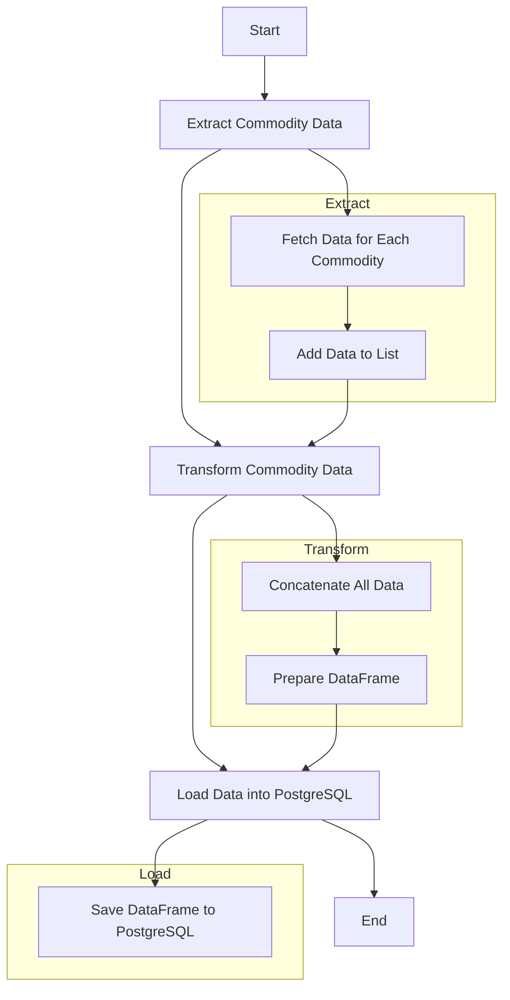

<h1 align="center">e2e-DE-project <br>
  (End-To-End Data Engineering Project)</h1>

Repository End-To-End Data Engineering Project is directed to build and manage a data pipeline using Python, SQL e dbt-core.

This tutorial is based on Luciano's video posted on [Youtube](https://www.youtube.com/watch?v=n3R0c2ZB6BQ).

To learn more, access the official [repository](https://github.com/lvgalvao/workshop-aberto-dw-do-zero-aovivo) with all class files.


This project uses DBT (Data Build Tool) to manage and transform data from a commodities Data Warehouse (DW). The goal is to create a robust and efficient data pipeline that processes and organizes commodity data and their transactions for analysis.

## Project Structure



### 1. Seeds

Seeds are static data that is loaded into the Data Warehouse from CSV files. In this project, seeds are used to load commodity transaction data.

### 2. Models

Models define data transformations using SQL. They are divided into two main layers: staging and datamart.

#### Staging

The staging layer is responsible for preparing and cleaning the data before it is loaded into the final analysis tables.

- **stg_commodities.sql**: Handles and formats the commodity data extracted from the API.
- **stg_movimentacao_commodities.sql**: Processes and formats the commodity transaction data.

#### Datamart

The datamart layer stores the final analysis data. It is based on the data prepared by the staging layer.

- **dm_commodities.sql**: Integrates the processed commodity and transaction data, creating a final data model for analysis.

### 3. Sources

Sources are the tables or data files that DBT uses to perform transformations.

### 4. Snapshots

Snapshots are used to maintain a historical record of how data changes over time.

## Directory Structure

```plaintext
├── models
│   ├── staging
│   │   ├── stg_commodities.sql
│   │   └── stg_movimentacao_commodities.sql
│   └── datamart
│       └── dm_commodities.sql
├── seeds
│   └── movimentacao_commodities.csv
├── dbt_project.yml
└── README.md
```

## Running the Project

### Requirements

- Python 3.7+
- DBT

### Execution Steps

1. **Clone the Repository**:
   ```bash
   git clone <Repository-URL>
   cd <Repository-Name>
   ```

2. **Install DBT**:
   ```bash
   pip install dbt-core dbt-postgres
   ```

3. **Configure DBT**:
   - Set up the `profiles.yml` file to connect to your Data Warehouse. The file should be located in the `~/.dbt/` directory or in the directory specified by the `DBT_PROFILES_DIR` environment variable.

   Example of a valid `profiles.yml`:
   ```yaml
   e2e_de_project:
     target: dev
     outputs:
       dev:
         type: postgres
         host: <DB_HOST_PROD>
         user: <DB_USER_PROD>
         password: <DB_PASS_PROD>
         port: <DB_PORT_PROD>
         dbname: <DB_NAME_PROD>
         schema: <DB_SCHEMA_PROD>
         threads: 1
   ```

4. **Run DBT Seeds**:
   ```bash
   dbt seed
   ```

5. **Run DBT Transformations**:
   ```bash
   dbt run
   ```

6. **Check Project Status**:
   ```bash
   dbt test
   ```

## Contribution

To contribute to the project, please fork the repository and submit a pull request with your changes.

---

### Model Descriptions

#### stg_commodities.sql

This model is responsible for processing and formatting the commodity data extracted from the API. It performs the necessary cleaning and transformation to prepare the data for the datamart.

#### stg_movimentacao_commodities.sql

This model is responsible for processing and formatting the commodity transaction data. It performs the necessary cleaning and transformation to prepare the data for the datamart.

#### dm_commodities.sql

This model integrates the processed commodity and transaction data, creating a final data model for analysis. It calculates metrics and aggregates the data to facilitate analysis on the dashboard.
